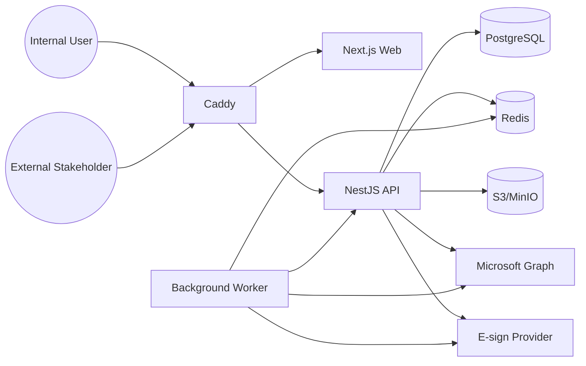

# Deployment Topology

## Runtime components

- Reverse proxy: Caddy (TLS termination)
- Frontend: Next.js web app
- API: NestJS app
- Worker: BullMQ processors
- Database: PostgreSQL
- Queue/cache: Redis
- Object storage: S3-compatible storage (MinIO for self-hosting)

## Mermaid deployment diagram

## Security boundaries

- Only reverse-proxy ports are public.
- PostgreSQL, Redis, MinIO admin ports stay private to Docker network.
- Secrets are environment-injected and not returned to browsers.
- Signed short-lived storage URLs are used for downloads.
