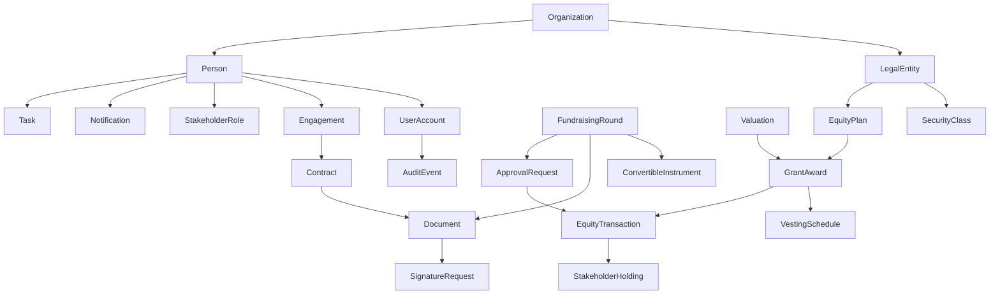

# Domain Model (Phase 0 Plan)

## Core principle

A single canonical Person represents a human or legal stakeholder identity across all domains. Roles and engagements attach to the same identity; they do not create disconnected records.

## High-level aggregates

- Organization
- LegalEntity
- Person
- UserAccount
- Engagement
- Contract
- Document
- SignatureRequest
- EquityPlan
- SecurityClass
- EquityTransaction (immutable)
- VestingSchedule
- GrantAward
- ExerciseEvent
- FundraisingRound
- ConvertibleInstrument
- Valuation
- ApprovalRequest
- Notification
- Task
- AuditEvent

## Mermaid domain map

## Time and arithmetic rules

- Store all timestamps in UTC.
- Display in user-selected timezone.
- Use decimal/integer fields for monetary and share calculations.
- Prohibit JavaScript float values for authoritative ledger math.
