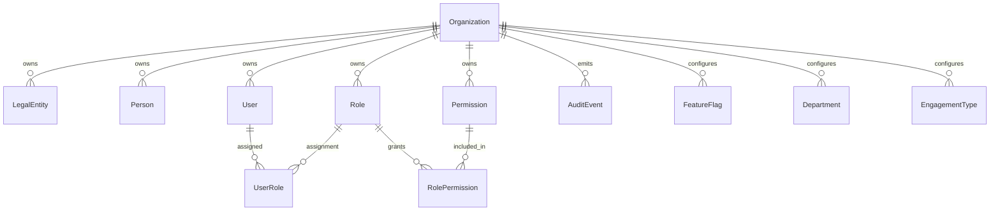

# Data Model Diagram (Phase 0)

```mermaid
erDiagram
  Organization ||--o{ LegalEntity : owns
  Organization ||--o{ Person : owns
  Organization ||--o{ User : owns
  Organization ||--o{ Role : owns
  Organization ||--o{ Permission : owns
  Role ||--o{ RolePermission : grants
  Permission ||--o{ RolePermission : included_in
  User ||--o{ UserRole : assigned
  Role ||--o{ UserRole : assignment
  Organization ||--o{ AuditEvent : emits
  Organization ||--o{ FeatureFlag : configures
  Organization ||--o{ Department : configures
  Organization ||--o{ EngagementType : configures
```
